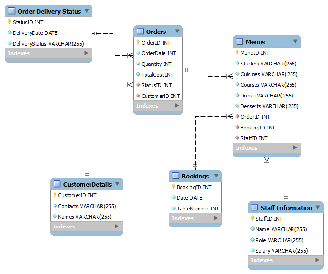

# Capstone project Little Lemon Database

## About

    
  </a>

  <h2 align="center">Meta Database Engineer Capstone</h2>

The capstone project serves as a culmination of the specialization [meta-database-engineer](https://www.coursera.org/professional-certificates/meta-database-engineer#courses), by demonstrating the skills that constitutes designing and composing a database solution and the relevant technologies.

## Acknowledgement  
This project utilizes synthetic data generated by OpenAI's ChatGPT. Due to the unavailability of the specific data initially intended for use in this capstone project course, I opted to leverage ChatGPT to create a realistic dataset that aligns with the project's requirements. This approach allowed us to proceed with the database and client system development for the Little Lemon restaurant, ensuring the project's continuity and the demonstration of the skills acquired throughout the project.

## Description 
This  project will design a data solution for the Little Lemon Restaurant. it involves setting upset a database, incorporating `Stored Procedures`, A way to interact with the client and the use of visualization to communicate the data.

tools used:
`MySQL(Workbench)` - For developing and setup of the databsase.
`Python` - Setting up a client and interacting with the database.
`Tableau` - Visualization of the data.

## Week 1 - Setting Up the Project
To get your database ready, follow the steps:

1. **Install MySQL:** If MySQL isn't already on your computer, download and install it.
2. **Get the SQL File:** Download the `LittleLemonDB.sql` file from this repository - in week-1.
3. **Set Up in MySQL Workbench:**
   - Open MySQL Workbench.
   - Go to `Server` > `Data Import`.
   - Select `Import from Self-Contained File` and choose the `LittleLemonDB.sql` file.
   - Hit `Start Import` to bring in and run the SQL commands from the file.

After these steps, your database will be set up with all the necessary tables and stored procedures ready to go.

### Entity-Relationship Diagram
---

Little Lemon wants you to use MySQL Workbench to develop a relational database system and implement it in MySQL server. Save your database capstone project files in a folder on your machine and name it db-capstone-project.

Task 1

In this task, you need to create a normalized ER diagram (that adheres to 1NF, 2NF and 3NF) with relevant relationships to meet the data requirements of Little Lemon. When creating your diagram, include the following tables:

    Bookings: To store information about booked tables in the restaurant including booking id, date and table number.

    Orders: To store information about each order such as order date, quantity and total cost.

    Order delivery status: To store information about the delivery status of each order such as delivery date and status.

    Menu: To store information about cuisines, starters, courses, drinks and desserts.

    Customer details: To store information about the customer names and contact details.

    Staff information: Including role and salary.

Here is some guidance for completing this task:

    Identify entities and related attributes. 

    Identify primary and foreign keys.

    Define data types and constraints. 

Once you have designed your ER diagram inside your MySQL Workbench Model Editor you then need to save your data model as LittleLemonDM and export it as a PNG file.

Task 2

In this second task, you need to implement the Little Lemon data model inside your MySQL server. Here is some guidance for completing this task:

    Use the forward engineer method in MySQL Workbench to implement the Little Lemon data model inside MySQL server. 

    Name your database LittleLemonDB. 

    Export the LittleLemonDB as a single contained SQL file and save it in the db-capstone-project folder.
    
-- MySQL Workbench Forward Engineering

SET @OLD_UNIQUE_CHECKS=@@UNIQUE_CHECKS, UNIQUE_CHECKS=0;
SET @OLD_FOREIGN_KEY_CHECKS=@@FOREIGN_KEY_CHECKS, FOREIGN_KEY_CHECKS=0;
SET @OLD_SQL_MODE=@@SQL_MODE, SQL_MODE='ONLY_FULL_GROUP_BY,STRICT_TRANS_TABLES,NO_ZERO_IN_DATE,NO_ZERO_DATE,ERROR_FOR_DIVISION_BY_ZERO,NO_ENGINE_SUBSTITUTION';

-- -----------------------------------------------------
-- Schema LittleLemonDM
-- -----------------------------------------------------

-- -----------------------------------------------------
-- Schema LittleLemonDM
-- -----------------------------------------------------
CREATE SCHEMA IF NOT EXISTS `LittleLemonDM` DEFAULT CHARACTER SET utf8 ;
USE `LittleLemonDM` ;

-- -----------------------------------------------------
-- Table `LittleLemonDM`.`Order_Delivery_Status`
-- -----------------------------------------------------
CREATE TABLE IF NOT EXISTS `LittleLemonDM`.`Order_Delivery_Status` (
  `StatusID` INT NOT NULL,
  `DeliveryDate` DATE NOT NULL,
  `DeliveryStatus` VARCHAR(255) NOT NULL,
  PRIMARY KEY (`StatusID`))
ENGINE = InnoDB;

-- -----------------------------------------------------
-- Table `LittleLemonDM`.`CustomerDetails`
-- -----------------------------------------------------
CREATE TABLE IF NOT EXISTS `LittleLemonDM`.`CustomerDetails` (
  `CustomerID` INT NOT NULL AUTO_INCREMENT,
  `Contacts` VARCHAR(255) NOT NULL,
  `Names` VARCHAR(255) NOT NULL,
  PRIMARY KEY (`CustomerID`))
ENGINE = InnoDB;

-- -----------------------------------------------------
-- Table `LittleLemonDM`.`Orders`
-- -----------------------------------------------------
CREATE TABLE IF NOT EXISTS `LittleLemonDM`.`Orders` (
  `OrderID` INT NOT NULL AUTO_INCREMENT,
  `OrderDate` INT NOT NULL,
  `Quantity` INT NOT NULL,
  `TotalCost` INT NOT NULL,
  `StatusID` INT NOT NULL,
  `CustomerID` INT NOT NULL,
  PRIMARY KEY (`OrderID`),
  INDEX `OrderDeliveryStatus_idx` (`StatusID` ASC) VISIBLE,
  INDEX `CustomerDetails_fk_idx` (`CustomerID` ASC) VISIBLE,
  CONSTRAINT `Order_Delivery_Status_fk`
    FOREIGN KEY (`StatusID`)
    REFERENCES `LittleLemonDM`.`Order_Delivery_Status` (`StatusID`)
    ON DELETE CASCADE
    ON UPDATE CASCADE,
  CONSTRAINT `CustomerDetails_fk`
    FOREIGN KEY (`CustomerID`)
    REFERENCES `LittleLemonDM`.`CustomerDetails` (`CustomerID`)
    ON DELETE CASCADE
    ON UPDATE CASCADE)
ENGINE = InnoDB;

-- -----------------------------------------------------
-- Table `LittleLemonDM`.`Bookings`
-- -----------------------------------------------------
CREATE TABLE IF NOT EXISTS `LittleLemonDM`.`Bookings` (
  `BookingID` INT NOT NULL AUTO_INCREMENT,
  `Date` DATE NOT NULL,
  `TableNumber` INT NOT NULL,
  PRIMARY KEY (`BookingID`))
ENGINE = InnoDB;

-- -----------------------------------------------------
-- Table `LittleLemonDM`.`Staff_Information`
-- -----------------------------------------------------
CREATE TABLE IF NOT EXISTS `LittleLemonDM`.`Staff_Information` (
  `StaffID` INT NOT NULL AUTO_INCREMENT,
  `Role` VARCHAR(255) NOT NULL,
  `Salary` VARCHAR(255) NOT NULL,
  PRIMARY KEY (`StaffID`))
ENGINE = InnoDB;

-- -----------------------------------------------------
-- Table `LittleLemonDM`.`Menu`
-- -----------------------------------------------------
CREATE TABLE IF NOT EXISTS `LittleLemonDM`.`Menu` (
  `MenuID` INT NOT NULL AUTO_INCREMENT,
  `Starters` VARCHAR(255) NOT NULL,
  `Cuisines` VARCHAR(255) NOT NULL,
  `Courses` VARCHAR(255) NOT NULL,
  `Drinks` VARCHAR(255) NOT NULL,
  `Desserts` VARCHAR(255) NOT NULL,
  `OrderID` INT NOT NULL,
  `BookingID` INT NOT NULL,
  `StaffID` INT NOT NULL,
  PRIMARY KEY (`MenuID`),
  INDEX `orders_fk_idx` (`OrderID` ASC) VISIBLE,
  INDEX `bookings_fk_idx` (`BookingID` ASC) VISIBLE,
  INDEX `staff_information_fk_idx` (`StaffID` ASC) VISIBLE,
  CONSTRAINT `orders_fk`
    FOREIGN KEY (`OrderID`)
    REFERENCES `LittleLemonDM`.`Orders` (`OrderID`)
    ON DELETE CASCADE
    ON UPDATE CASCADE,
  CONSTRAINT `bookings_fk`
    FOREIGN KEY (`BookingID`)
    REFERENCES `LittleLemonDM`.`Bookings` (`BookingID`)
    ON DELETE CASCADE
    ON UPDATE CASCADE,
  CONSTRAINT `staff_information_fk`
    FOREIGN KEY (`StaffID`)
    REFERENCES `LittleLemonDM`.`Staff_Information` (`StaffID`)
    ON DELETE CASCADE
    ON UPDATE CASCADE)
ENGINE = InnoDB;

-- -----------------------------------------------------
-- Table `LittleLemonDM`.`category`
-- -----------------------------------------------------
CREATE TABLE IF NOT EXISTS `LittleLemonDM`.`category` (
  `category_id` INT NOT NULL,
  `name` VARCHAR(255) NOT NULL,
  PRIMARY KEY (`category_id`));

SET SQL_MODE=@OLD_SQL_MODE;
SET FOREIGN_KEY_CHECKS=@OLD_FOREIGN_KEY_CHECKS;
SET UNIQUE_CHECKS=@OLD_UNIQUE_CHECKS;

Task 3

In the third and final task, you need to show the databases in the MySQL server. Write a SQL code inside MySQL Workbench SQL editor to show all your databases in MySQL server. Check if the Little Lemon database is included in the list.

## Week 2 - Create Optimized Queries to Manage and Aalyze Data

Little Lemon needs to query the data in their database. To do this, they need your help with creating optimized queries using stored procedures and prepared statements.

Prerequisites
In the previous module, you developed a data model for Little Lemon and implemented it in your MySQL server. Your database should now contain several tables including the following:

    Menus, 

    Orders, 

    MenuItems,

    and Customers.
    
Refer to the folder for extra screenshots

## Week 3 - Visualization in Tableau
